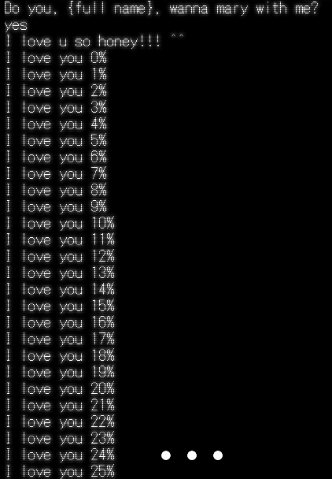

<h1 align="center">
    💍Marry 
</h1>

    
 
       <b>"Marry" is a project for my boyfriend. </b>  
       <b>"Marry" é um projeto para meu namorado. </b>  
    

    
     
    
        

    
    

        <h2>☆</h2>
        
PT/BR

        

            Eu tenho que estudar a linguagem Ruby, então eu decidi fazer um presentinho para meu amor.   Esse projeto é uma piadinha para sua futura esposa ou seu futuro esposo com um tom yandere.  
            Essa é a versão em português: <a href="marry (pt-br)">marry (pt-br)</a>
        

        <h2>☆</h2>
        
EN

        

            I have to study the Ruby language, so I decided to make a little present for my love.   This project is a little joke for your future wife or husband with a yandere tone.  
            This is the english version: <a href="marry (eng)">marry (eng)</a>
        

    

